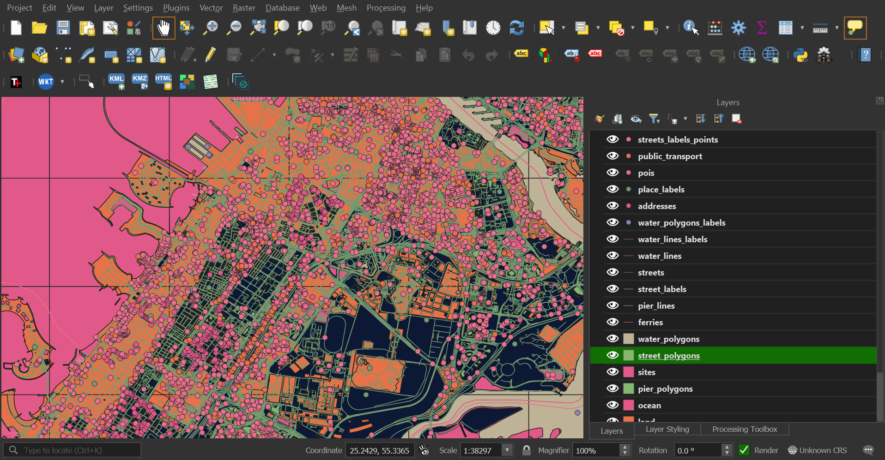
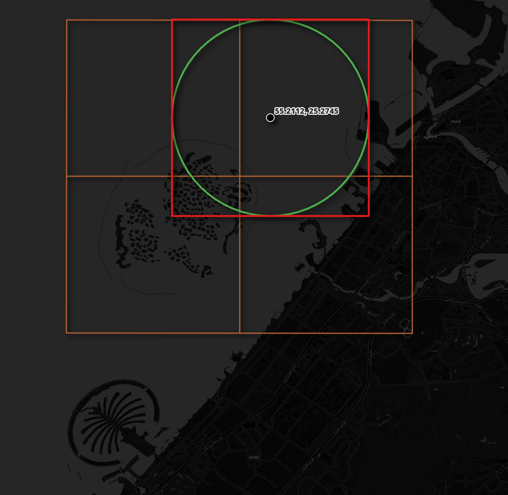

# tiles2columns

This package converts OpenStreetMap's (OSM) vector tiles to GPKG and Parquet format. https://tech.marksblogg.com/osm-mvt-vector-tiles.html has more details.



## Installation

The following should work on Ubuntu and Ubuntu for Windows.

```bash
$ sudo apt update
$ sudo apt install \
    python3-pip \
    python3-virtualenv

$ python3 -m venv ~/.tiles2columns
$ source ~/.tiles2columns/bin/activate

$ git clone https://github.com/marklit/tiles2columns ~/tiles2columns
$ python -m pip install -r ~/tiles2columns/requirements.txt
```

If you're using a Mac, install [Homebrew](https://brew.sh/) and then run the following.

```bash
$ brew install \
    git \
    virtualenv

$ virtualenv ~/.tiles2columns
$ source ~/.tiles2columns/bin/activate

$ git clone https://github.com/marklit/tiles2columns ~/tiles2columns
$ python -m pip install -r ~/tiles2columns/requirements.txt
```

## Usage Example

This will download an area around Northern Dubai with 42 tiles.

```bash
$ mkdir -p ~/dubai
$ cd ~/dubai

$ python3 ~/tiles2columns/main.py \
                bbox \
                55.2112  25.2745 \
                55.34279 25.17104
```

The data will be saved in GeoPackage format by default. Use ``--pq`` to produce spatially-sorted, ZStandard-compressed Parquet instead.

```bash
$ ls -lhS *.gpkg
```

```
6.8M .. streets.gpkg
6.2M .. buildings.gpkg
1.4M .. pois.gpkg
1.4M .. street_labels.gpkg
744K .. land.gpkg
372K .. sites.gpkg
248K .. addresses.gpkg
244K .. water_polygons.gpkg
216K .. ocean.gpkg
196K .. pier_polygons.gpkg
164K .. public_transport.gpkg
132K .. pier_lines.gpkg
124K .. streets_labels_points.gpkg
112K .. ferries.gpkg
104K .. bridges.gpkg
104K .. place_labels.gpkg
104K .. street_polygons.gpkg
104K .. water_lines.gpkg
 96K .. dam_polygons.gpkg
 96K .. water_lines_labels.gpkg
 96K .. water_polygons_labels.gpkg
```

Parquet files will generate faster than GeoPackage files but GeoPackage files can be dropped onto a QGIS project whereas Parquet will need to be imported via the Add Vector Layers UI.

The properties of each piece of geometry live in their own columns.

```bash
$ ~/duckdb
```

```sql
.maxrows 20

SELECT geom,
       name
FROM   ST_READ('pois.gpkg')
WHERE  name IS NOT NULL;
```

```
┌───────────────────────────────────────────────┬─────────────────────────────────────────────┐
│                     geom                      │                    name                     │
│                   geometry                    │                   varchar                   │
├───────────────────────────────────────────────┼─────────────────────────────────────────────┤
│ POINT (55.34712553024292 25.24918890107886)   │ Kiku                                        │
│ POINT (55.34385323524475 25.248873526657135)  │ Fujiya Restaurant                           │
│ POINT (55.34536063671112 25.24823792341191)   │ Mövenpick Grand Al Bustan Dubai             │
│ POINT (55.3471577167511 25.248616374599663)   │ Sukhothai                                   │
│ POINT (55.34707725048065 25.248858970894826)  │ Méridien Village Terrace                    │
│ POINT (55.347533226013184 25.24869400546682)  │ M's Beef Bistro                             │
│ POINT (55.347495675086975 25.248757080509858) │ M's Seafood Bistro                          │
│ POINT (55.34720063209534 25.248645486180656)  │ Le Méridien Dubai Hotel & Conference Centre │
│ POINT (55.34764587879181 25.248529039814816)  │ Long Yin                                    │
│ POINT (55.34729182720184 25.24847081659004)   │ Le Méridien                                 │
│                      ·                        │      ·                                      │
│                      ·                        │      ·                                      │
│                      ·                        │      ·                                      │
│ POINT (55.34357964992523 25.250887056969173)  │ Grand Mercure Dubai Airport                 │
│ POINT (55.343536734580994 25.250236908661204) │ Perfect Nail                                │
│ POINT (55.344228744506836 25.25049890914417)  │ ibis Styles Dubai Airport                   │
│ POINT (55.343976616859436 25.250867649607375) │ Grand Mercure Dubai Airport                 │
│ POINT (55.3454464673996 25.251726422399933)   │ Ashrafi                                     │
│ POINT (55.34471154212952 25.25214852883526)   │ Bin Hindi Outlet                            │
│ POINT (55.34568250179291 25.251959308890466)  │ Restaurant                                  │
│ POINT (55.349024534225464 25.25042127943035)  │ Emirates NBD ATM                            │
│ POINT (55.344985127449036 25.257708552546877) │ The Draft House Sports Bar and Canteen      │
│ POINT (55.344722270965576 25.25779102916772)  │ McDonald's                                  │
├───────────────────────────────────────────────┴─────────────────────────────────────────────┤
│ 6329 rows (20 shown)                                                              2 columns │
└─────────────────────────────────────────────────────────────────────────────────────────────┘
```

### From a point

The following will download 35 tiles that intersect with the bounding box around the radius around the point.

```bash
$ python3 ~/tiles2columns/main.py \
            centroid \
            55.2112 25.2745 \
            --distance=0.05
```

The point defined above is marked with a black dot. Its radius is outlined with a green circle. The radius' bounding box is outlined with a red box. There are four figurative OSM tiles intersecting that red box are outlined in orange.

Any data in those tiles will be downloaded.

